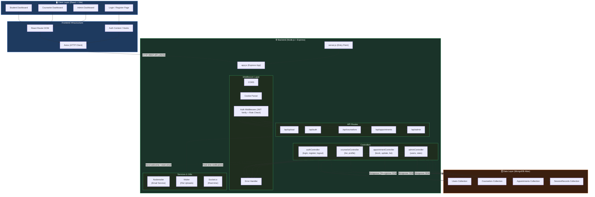

# Technical Architecture Diagram

## System Architecture: Student Counselling Management System

---

## Data Flow Explanation

| Step | Action |
|------|--------|
| 1 | User interacts with a React page (Login, Book Appointment, etc.) |
| 2 | **Axios** sends an HTTP request to the Express API (e.g., `POST /api/appointments`) |
| 3 | **CORS** middleware validates the request origin |
| 4 | **Auth Middleware** verifies the JWT from the cookie and checks the user's role |
| 5 | The request is forwarded to the appropriate **Controller** |
| 6 | The Controller runs business logic and communicates with **MongoDB** via Mongoose |
| 7 | For side-effects, the controller may trigger **Nodemailer** (emails) or **Socket.io** (real-time events) |
| 8 | The Controller returns a JSON response back to the React frontend |
| 9 | React updates state and re-renders the UI |

---

## MongoDB Collections (Data Schema Summary)

| Collection | Key Fields |
|---|---|
| `Users` | `_id`, `name`, `email`, `password (hashed)`, `role (student/counselor/admin)`, `profilePicture` |
| `Counselors` | `_id`, `user (ref)`, `specialization`, `availability`, `bio` |
| `Appointments` | `_id`, `student (ref)`, `counselor (ref)`, `date`, `status (pending/confirmed/completed)` |
| `SessionRecords` | `_id`, `appointment (ref)`, `notes (confidential)`, `createdAt` |
